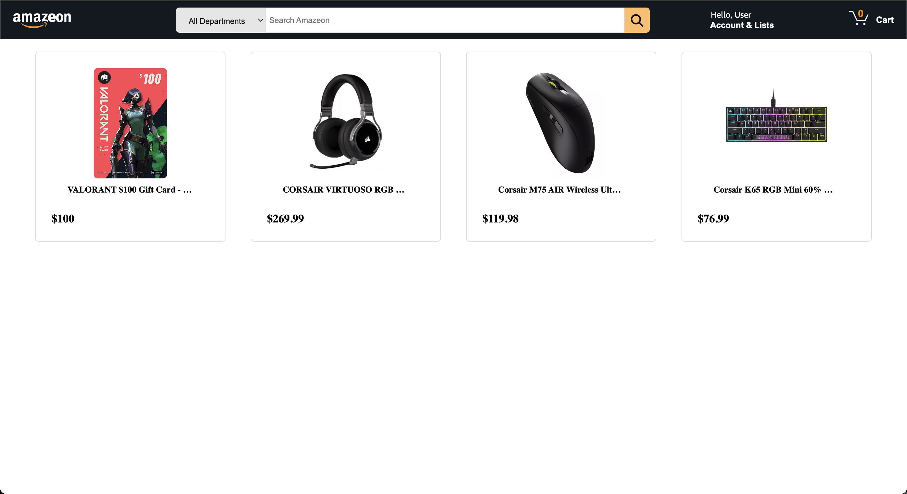
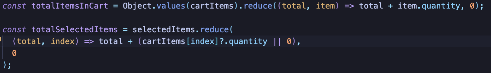
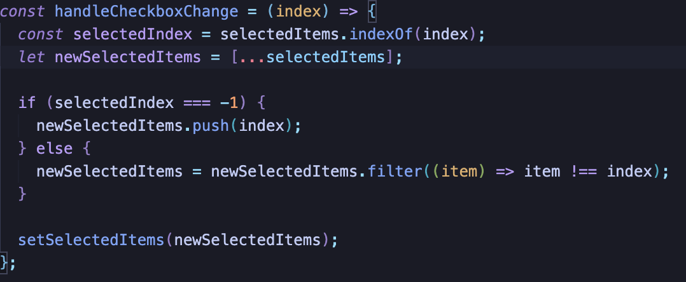
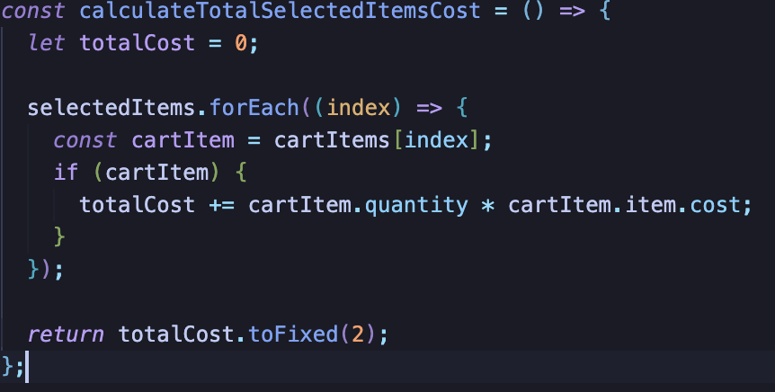
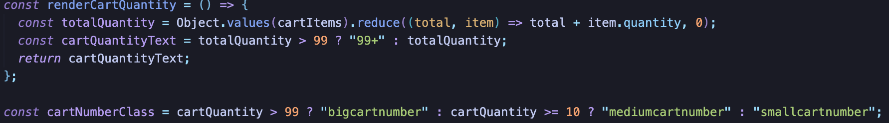

 

# Description
Amazeon, a clone of Amazon, is an e-commerce company that allows users to purchase a wide range of products from life necessities or items of passion. 

# Controls
You navigate to different pages by clicking certain items and buttons to display more information about said item or checkout said item/s.

# Technical Details
Amazeon was coded using React-Redux for the frontend and as for the backend, it was coding by using JS. I also implemented HTML and CSS. 

# Feature Implementation
 

The function totalItemsInCart allows the user to see how many items there are in cart by iterating through an object of cart items and getting the quanity of every item, then adding it to the total. The function totalSelectedItems allow us to see how many items are actually selected by seeing if there is a quanity if an item, if there is add one to the total, if not then set the total to zero.

 

This function handleCheckboxChange checks if the item is currently checked or not. We first check for if the index is in the selectedItems array aka if its checked. If it's not checked then selectedIndex will be -1. If its -1 push the item into a new array. If it's not -1 then we know its in the array and so we can filter it out from the rest of the array.

 

This function iterates through an array of all the selected items and gets their cost and muliplating it with their quanity to result in a total cost of all the items that are selected.

 

These functions grabs the quanity from the cart and changes the font depending on how many items are in the cart.