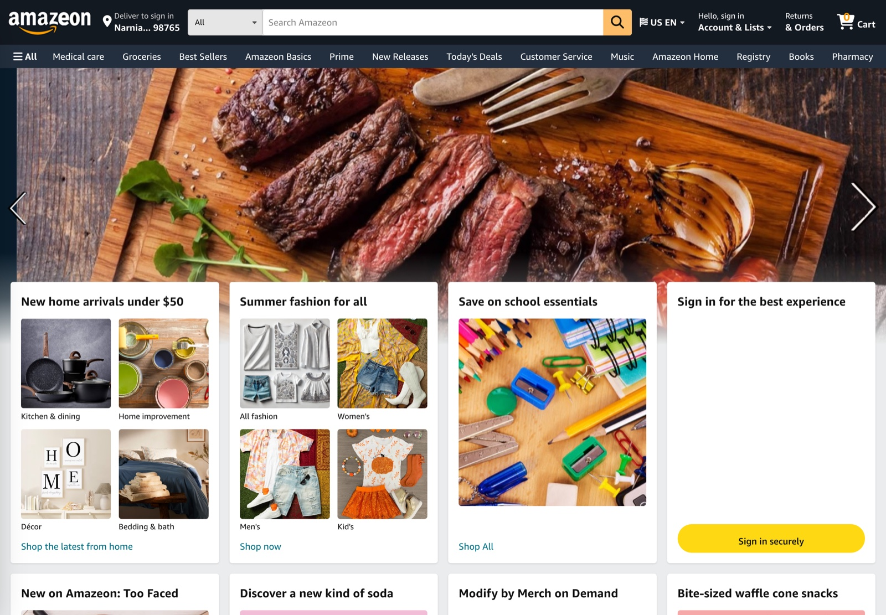

# Amazeon

A full-stack Amazon marketplace clone — browse a catalog by category, search, read and write
reviews, manage a cart, and check out. Built with a Ruby on Rails API and a React + TypeScript
single-page app.



## Tech stack

**Frontend** — React 19 · TypeScript · Vite · Redux Toolkit · React Router 7 · Tailwind CSS 4 · Embla Carousel

**Backend** — Ruby on Rails 7 (API-only) · PostgreSQL · Active Record · Active Storage · bcrypt session auth with CSRF

## Highlights

- **Session-token authentication** with CSRF-protected requests (sign up, log in, log out)
- **Catalog** with category filtering and prefix search
- **Product pages** with stock, quantity selection, and average star ratings
- **Reviews** — create, edit, and delete your own
- **Cart** with per-item quantities, selection, live subtotal, and a checkout that decrements stock
- **Typed Redux store** (Redux Toolkit) and a fully typed component tree
- **Runs with zero secrets** — images are stored on local disk, so a fresh clone works out of the box

## Getting started

### Prerequisites
- Ruby 3.1.1
- Node.js 20+
- PostgreSQL

### Setup
```bash
# 1. Backend
bundle install
bin/rails db:create db:migrate db:seed   # seeds 17 products + a demo user

# 2. Frontend
cd frontend && npm install
```

### Run (two terminals)
```bash
bin/rails server                 # API on http://localhost:5000
```
```bash
cd frontend && npm run dev       # app on http://localhost:3000 (proxies /api to :5000)
```

Open http://localhost:3000 and sign in with the demo account:

> **Email:** `Demouser@gmail.com`  **Password:** `Password`

## Project structure

```
.
├── app/
│   ├── controllers/api/     REST controllers (items, reviews, cart, sessions, users)
│   ├── models/              User, Item, Review, CartItem
│   └── views/api/           jbuilder JSON views
├── config/                  Routes and Rails configuration
├── db/                      Migrations, schema, and seeds
├── docs/                    README screenshots
└── frontend/
    └── src/
        ├── app/             Store configuration and typed hooks
        ├── features/        Redux Toolkit slices (session, items, cart, reviews, nav)
        ├── components/      Reusable UI (NavBar, StarRating, Items)
        ├── pages/           Route-level views
        ├── lib/             CSRF fetch helper
        ├── types/           Shared TypeScript types
        └── assets/          Images and fonts
```

## Frontend scripts
| Command | Description |
| --- | --- |
| `npm run dev` | Start the Vite dev server |
| `npm run build` | Type-check and build the production bundle into `/public` |
| `npm run preview` | Preview the production build |
| `npm run lint` | Run ESLint |
| `npm run typecheck` | Run the TypeScript compiler |
| `npm run test` | Run the Vitest suite |

## Testing
- **Backend** (RSpec): model specs and request specs for every API endpoint.
  ```bash
  bundle exec rspec
  ```
- **Frontend** (Vitest + Testing Library): Redux slice/selector tests and component tests.
  ```bash
  cd frontend && npm run test
  ```

## Deployment (Render)
The SPA builds into `/public`, which Rails serves (a catch-all route keeps client-side routing
working on deep links). Configure the web service as:

- **Build Command:** `bin/render-build.sh` (installs gems + builds the SPA)
- **Start Command:** `bin/render-predeploy.sh && bundle exec rails server` (migrates + seeds at
  runtime, then boots — the Pre-Deploy Command is paid-only, so migrations run in the start command)
- **Environment:** `SECRET_KEY_BASE` and a `DATABASE_URL` pointing at a PostgreSQL instance in the
  same region as the web service
